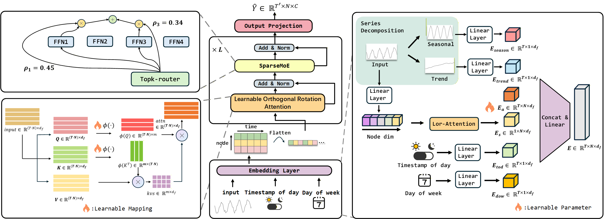

# LOSTFormer
🌟Our paper proposes **LOSTFormer (Linear Orthogonal Spatio-Temporal Transformer)**, an architecture designed for efficient and accurate spatio-temporal forecasting. The model first extracts temporal and spatial features through **Series Decomposition Embedding** and **Spatial Correlation Embedding**. Then, multiple Transformer Blocks are stacked, each integrating **a Learnable Orthogonal Rotation Attention (Lor-Attention)** mechanism and a Sparse Mixture-of-Experts (SparseMoE) layer to model comprehensive spatio-temporal dependencies efficiently.The overall framework is as follows: 


# ⚙️Prerequisites
To get started, ensure you are using Python 3.10. Install the necessary dependencies by running:
```
pip install -r requirements.txt
```

# 📖Datesets
🚀The dataset used for testing will be open-sourced soon.

# 🏃Training Example
All training scripts are located in the `./scripts` directory.To train a model using the PEMS07 dataset, run the following command:
```
./scripts/PEMS07.sh
```
